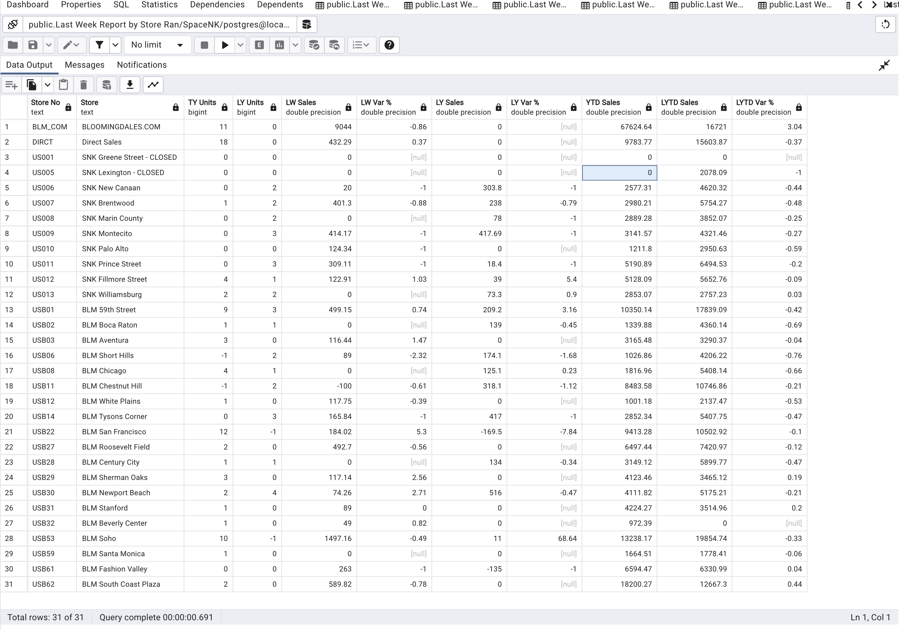

## Summary

Extract, transform, load (ETL) python 3 script that extracts data from local excel file and insert the data in a postgres database table.

## Requirements

Write a Python 3 function which will extract data from the first sheet, transform it and load it to a
Postgres database table. You need to create the table first according to the excel report fields.
Do not load (sub)totals. The function should be able to load data from excel reports with the
same structure, but different number of rows.

### *Installation process* :

- Clone repo
- Navigate to project root folder
- Install all dependencies with pip install psycopg2 pandas sqlalchemy or pip3 install psycopg2 pandas sqlalchemy (for mac os)
- Set up environment variables in bash_profile for database username, password,  and host or hard code data into url_object

## Author(s)

* Robert C. Haye

## Output in Postgres Database Table

